###  **Background** 

The project visualizes China railway data from 2014-2022 in electronic map using Angualr, Echarts, turf.js, Mapbox.js and other third-party libraries.
It contains 4 parts, including file management, buffer analysis, railway change visualization and railway change influencing-factors. Besides, it also offers some basic map functions.
Based on the China Railway System, this project researches and discusses how to realize the visual display of China's road network data in electronic maps.

###  **project Demo** 

- railway change visualization
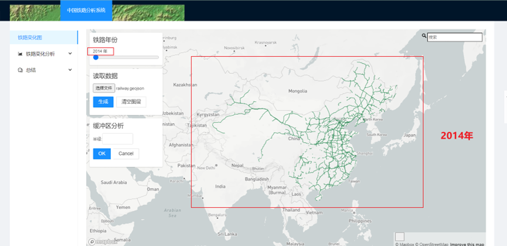
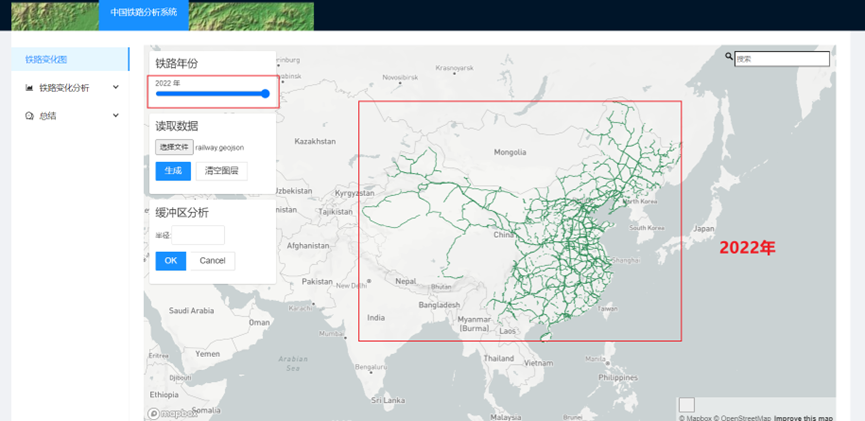
- buffer analysis
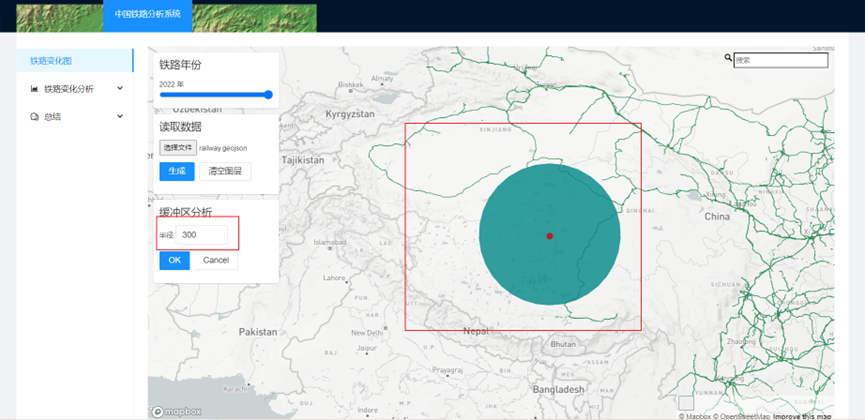
- railway change influencing-factors
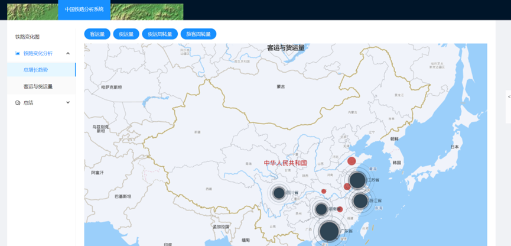
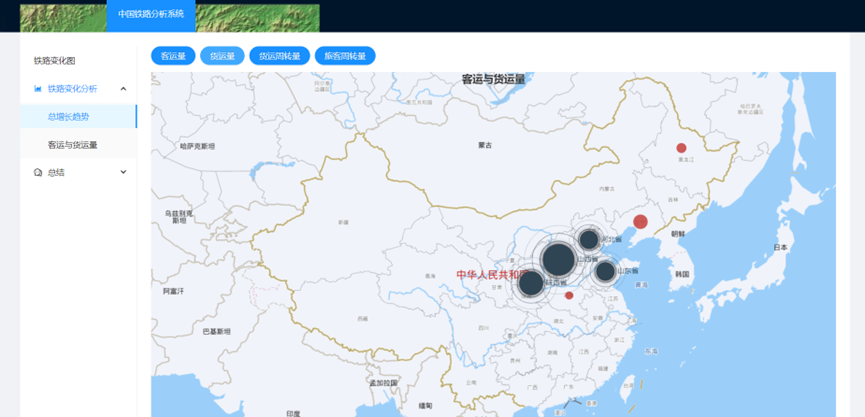
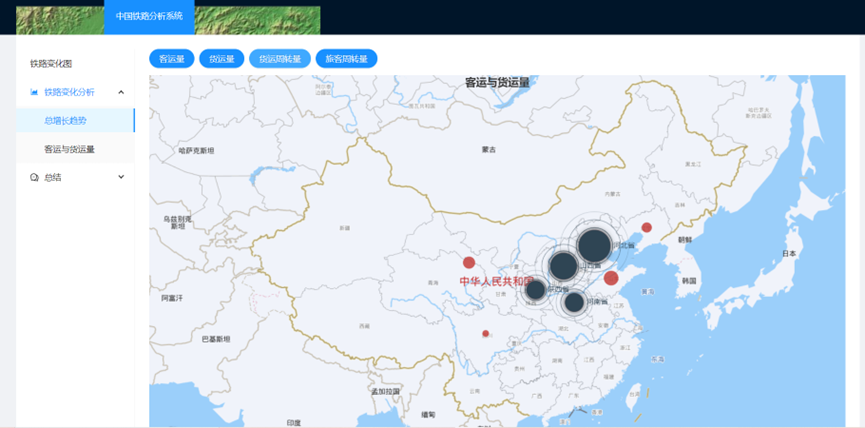
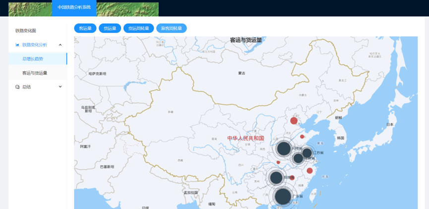
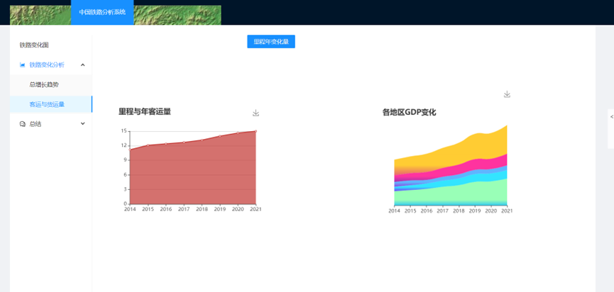
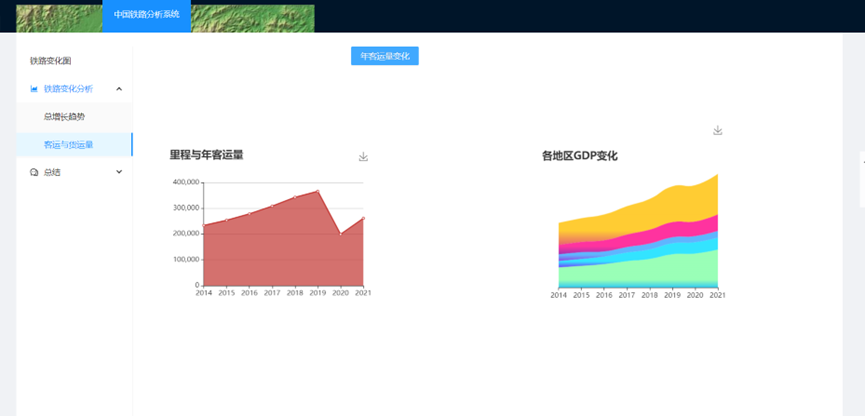
- file management
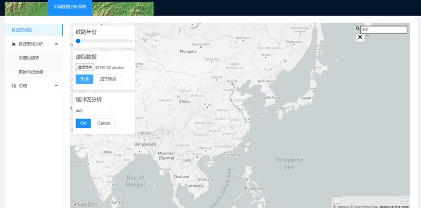
- search location
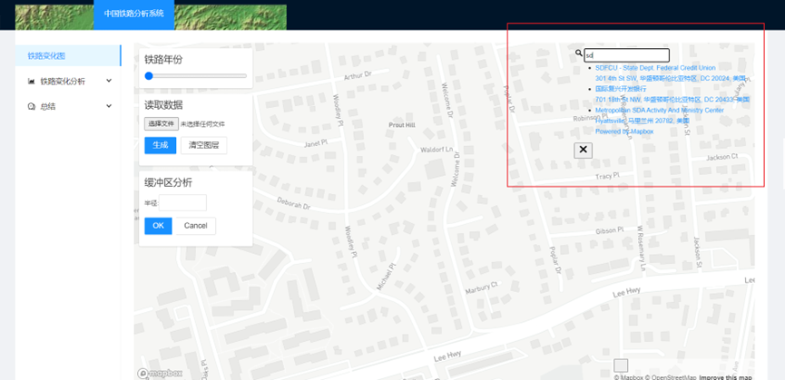

